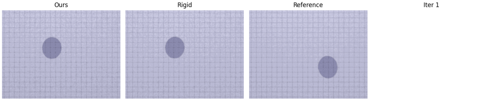

## Plateau-reduced Differentiable Path Tracing

This is the offical code repository for our paper

**Plateau-reduced Differentiable Path Tracing [CVPR 2023]**

by [Michael Fischer](https://mfischer-ucl.github.io) and [Tobias Ritschel](https://www.homepages.ucl.ac.uk/~ucactri). 
For more information, make sure to check out the [paper](https://arxiv.org/pdf/2211.17263.pdf) 
and [project page](https://mfischer-ucl.github.io/prdpt/).

<p align="center">
 
</p>

___
### Installation

Clone the repository, then create a new conda environment, activate it and install the dependencies.  
```
git clone https://github.com/mfischer-ucl/prdpt 
cd prdpt 
conda create -n prdpt python=3.9 
conda activate prdpt 
pip install mitsuba
pip install matplotlib
pip install torch torchvision torchaudio
```

You should then be able to run the example in `examples/sphere_example.py`.  

Tested with Python 3.9, PyTorch 2.0 and CUDA 11.7 on Ubuntu 20.04.4 x64 and an NVIDIA RTX3000 series GPU.   
___
### Usage 

This repository uses [Mitsuba3](https://mitsuba.readthedocs.io/en/stable/#) as rendering backbone. The core functionality, 
i.e., the importance sampler and kernel functions, reside in `utils_fns.py`.  We prodive the sphere example on top under 
`examples/sphere_example.py`. The main function running the optimization routine is `run_optimization.py`.   

#### Running your own experiments
To run your own optimizations, simply provide a Mitsuba scene and extract the information needed
for your use case (as in `setup_shadowscene.py`). You will also need to adapt the `update_fn` to update the scene 
parameters accordingly, e.g., to apply rotation instead of translation). 

If you want to use a different rendering engine, replace the function `get_mts_rendering` with your own 
rendering function. An example of this is provided in the [colab notebook](https://colab.research.google.com/github/mfischer-ucl/prdpt/blob/main/examples/box_example.ipynb) under `examples/box_position.ipynb`, where we use a simple rectangle-renderer. 
You can make use of the `ctx_args` dict to pass data between function calls. 

___
### License 
This code is licensed under the MIT license. 
___
### Citation

If you find our work useful or plan to (re-) use parts of it in your own projects, please include the following citation:

```
@inproceedings{fischer2023plateau,
  title={Plateau-Reduced Differentiable Path Tracing},
  author={Fischer, Michael and Ritschel, Tobias},
  booktitle={Proceedings of the IEEE/CVF Conference on Computer Vision and Pattern Recognition},
  pages={4285--4294},
  year={2023}
}
```
